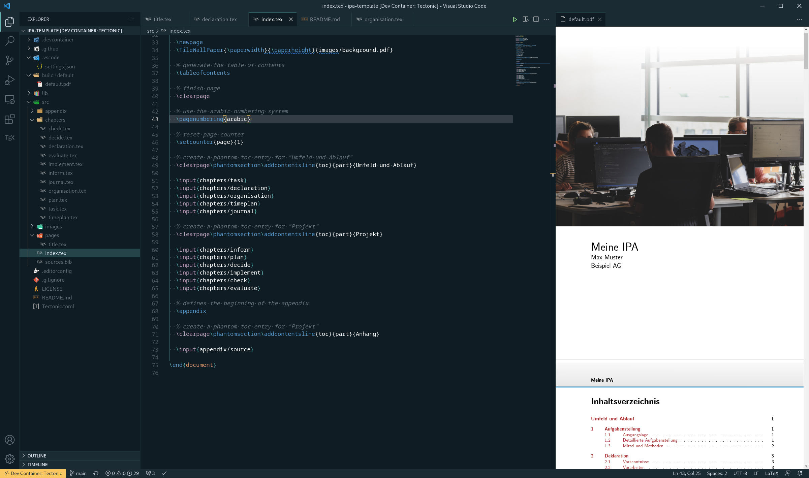

# IPA Vorlage

> :warning: **Disclaimer**: Die Richtigkeit dieser Vorlage wird hiermit in Abrede gestellt. Der oder die Autoren übernehmen keine Gewährleistung. Diese Vorlage ist **keine** offizielle Vorlage einer Prüfungsorganisation.

Informatiklernende (EFZ) schliessen Ihre Ausbildung mit einer individuellen praktischen Abschlussprüfung (IPA) ab. Dabei sind umfangreiche Dokumentationsarbeiten notwendig. Diese Vorlage hilft dabei sich auf die Inhalte und Realisierung konzentrieren zu können und keine Inhalte zu vergessen. Mit dieser Vorlage ist es möglich, innert Minuten mit der produktiven Arbeit am IPA-Bericht zu beginnen.

 - [Zeitplanvorlage mit Google Sheets](https://docs.google.com/spreadsheets/d/1kZ3AUNItc1EV2Pz2bjDTaP_TFSRrj1S5dGMjM3ucCRw)

## Funktionen

- Moderne TeX/LaTeX Umgebung [Tectonic](https://tectonic-typesetting.github.io/en-US/)
- Visual Studio Code mit [Remote Containers](https://marketplace.visualstudio.com/items?itemName=ms-vscode-remote.remote-containers)
- Continuous Integration und Continuous Delivery mit Github Actions
- Integrierte Vorlage für den IPA Bericht
- Konfigurierbar über Variablen in `src/index.tex`

## Loslegen

1. Eigenes Repository von der Vorlage generieren mit `Use this template`
1. Repository klonen
1. Ordner in Visual Studio Code mit installierter Erweiterung [Remote Containers](https://marketplace.visualstudio.com/items?itemName=ms-vscode-remote.remote-containers) öffnen
1. `src/index.tex` öffnen und <kbd>CTRL</kbd>+<kbd>ALT</kbd>+<kbd>b</kbd> oder über <kbd>CTRL</kbd>+<kbd>P</kbd> das Kommando `LaTeX Workshop: Build LaTeX project` aufrufen
1. `build/default/default.pdf` öffnen
1. Dokument ändern, die Vorschau des PDFs aktualisiert sich fortlaufend
1. Variablen in `src/index.tex` anpassen
1. Commits mit den gemachten Änderungen erstellen
1. Commits ins Repository drücken (push)
1. Github Actions läuft automatisch und generiert ein Artefakt, welches das aktuelle Dokument enthält. Dieses [Video](res/find-artifacts.webm) zeigt das Vorgehen:

[Video zu Github Actions](https://user-images.githubusercontent.com/1105080/217743574-3568e8e8-8c52-4c41-a64a-f60f2adc5172.webm)

## Werkzeuge

Für die Realisierung der IPA könnten folgende Werkzeuge und Programme nützlich sein:

- [diagrams.net](https://diagrams.net) für Diagramme aller Art: UML, ...
- [umletino.com](https://www.umletino.com/) oder [umlet.com](https://www.umlet.com/) für UML Diagramme
- [UMLet Visual Studio Code Extension](https://marketplace.visualstudio.com/items?itemName=TheUMLetTeam.umlet)

## Kriteriennachweis

Dieser Abschnitt bezieht sich auf den [Standardkritierenkatalog](https://pk19.ch/wp-content/uploads/2021/11/Kriterienkatalog-Standardkriterien_2022.pdf) und dessen [Leitfaden](https://pk19.ch/wp-content/uploads/2021/11/QV-Leitfaden_2022.pdf). Unterhalb wird ein Bezug zwischen den Kriterien und dieser Vorlage hergestellt.

Der Status wird durch folgende Symbole definiert:

| Symbol | Bedeutung |
| ------ | --------- |
| ✔️ | Dieses Kriterium ist in der Vorlage beispielhaft umgesetzt. |
| ⏳ | Dieses Kriterium wird noch in der Vorlage umgesetzt. |
| ⚡ | Zu diesem Kriterium gibt es Hinweise und Beispiele, welche noch angepasst werden müssen. |
| ❌ | Dieses Kriterium kann nicht oder nur teilweise mit dem IPA-Bericht umgesetzt werden. |
| 🧑‍🎓 | Dieses Kriterium muss individuell in der Vorlage geprüft oder umgesetzt werden. |

### Teil A
 - [A1: Projektmanagement und Planung](#a1)
 - [A2: Wissensbeschaffung](#a2)
 - [A3: Zeitplan](#a3)
 - [A4: Konzeptionelle Umsetzung](#a4)
 - [A5: Projektumfeld: Systemgrenzen / Schnittstellen zur Aussenwelt](#a5)
 - [A6: Testkonzept](#a6)
 - [A7: Leistungsfähigkeit](#a7)
 - [A8: Selbständiges Arbeiten](#a8)
 - [A9: Fachkenntnisse und Anwendungskompetenz](#a9)
 - [A10: Anwendung der Fachsprache](#a10)
 - [A11: Arbeits- und Fachmethodik](#a11)
 - [A12: Organisation der Arbeitsergebnisse](#a12)
 - [A13: IPA-Erfüllungsgrad](#a13)

#### A1: Projektmanagement und Planung

| ID    | Anforderung | Referenz | Bemerkungen | Status |
| ----- | ----------- | -------- | ----------- | ------ |
| A1.1a | "Die gewählte Projektmanagement-Methode ist im Bericht benannt" | [`src/chapters/inform.tex`](src/chapters/inform.tex) | | ✔️ |
| A1.1b | "[..] und passt zum Auftrag." | [`src/chapters/inform.tex`](src/chapters/inform.tex) | In den allermeisten Fällen lässt sich IPERKA anwenden und begründen. | 🧑‍🎓 |
| A1.2 | "Die gewählte Projektmanagement-Methode wurde in der praktischen Arbeit korrekt angewandt." | | Dies lässt sich oftmals gut im Zeitplan erkennen, indem geprüft wird, ob die Aufgaben den passenden Phasen zugeordnet sind. | 🧑‍🎓 |
| A1.3 | "Die korrekte Anwendung der Projektmanagement-Methode ist im IPA-Bericht ersichtlich." | [`src/index.tex`](src/index.tex) | Dies lässt sich gut am Inhaltsverzeichnis ablesen. | ✔️ |
| A1.4 | "Der Auftrag wurde ausgehend von der Aufgabenstellung weiter analysiert und verfeinert." | [`src/chapters/plan.tex`](src/chapters/plan.tex) | | ⏳ |

#### A2: Wissensbeschaffung

| ID    | Anforderung | Referenz | Bemerkungen | Status |
| ----- | ----------- | -------- | ----------- | ------ |
| A2.1 | "Der Nachweis der Wissensbeschaffung ist durch Arbeitsjournal, Projektbericht oder Protokolle zu Fachgesprächen (HE, VF) dokumentiert." | [`src/chapters/journal.tex`](src/chapters/journal.tex) | | ✔️ |
| A2.2 | "Wählte die Informationsquellen aufgabenbezogen aus." | [`src/sources.bib`](src/sources.bib) | | 🧑‍🎓 |
| A2.3 | "Hat aus den gewählten Informationsquellen die relevanten Informationen identifiziert und genutzt (Transferleistung)." | Mit `\cite` und dem in `src/sources.bib` definierten Key kann eine Zitierung eingefügt werden. Das Literaturverzeichnis wird entsprechend nach IEEE automatisch generiert. | | ✔️ |
| A2.4 | "Die referenzierten Quellen sind existent und für Projektinvolvierte rekonstruierbar." | [`src/sources.bib`](src/sources.bib) | Mit `\cite` und dem in `src/sources.bib` definierten Key kann eine Zitierung eingefügt werden. Das Literaturverzeichnis wird entsprechend nach IEEE automatisch generiert. | 🧑‍🎓 |

#### A3: Zeitplan

Diese [Vorlage](https://docs.google.com/spreadsheets/d/1kZ3AUNItc1EV2Pz2bjDTaP_TFSRrj1S5dGMjM3ucCRw) hilft bei der schnellen Umsetzung des gewünschten Zeitplans. Im Tabellenblatt `Variabeln` können die IPA-Tage definiert werden. Die SOLL- und IST-Zeiten sind mit einem `S` bzw. `I` in den einzelnen 2-Stundenblöcken zu erfassen.

| ID    | Anforderung | Referenz | Bemerkungen | Status |
| ----- | ----------- | -------- | ----------- | ------ |
| A3.1 | "Es wurde eine absolute Zeitachse definiert (Datum)." | [`src/chapters/timeplan.tex`](src/chapters/timeplan.tex) | | ✔️ |
| A3.2 | "Die Zeitachse hat eine vernünftige Auflösung (1, 2- oder 4-Stundenblöcke)." | [`src/chapters/timeplan.tex`](src/chapters/timeplan.tex) | | ✔️ |
| A3.3 | "Zweckmässige Tätigkeiten decken die ganze Arbeit ab." | [`src/chapters/timeplan.tex`](src/chapters/timeplan.tex) | | 🧑‍🎓 |
| A3.4 | "Die Reihenfolge der Tätigkeiten ist sinnvoll." | [`src/chapters/timeplan.tex`](src/chapters/timeplan.tex) | | 🧑‍🎓 |
| A3.5 | "Die Zeitaufwände für die Tätigkeiten wurden realistisch geplant." | [`src/chapters/timeplan.tex`](src/chapters/timeplan.tex) | | 🧑‍🎓 |
| A3.6 | "Der Soll/Ist-Vergleich ist transparent und korrekt." | [`src/chapters/timeplan.tex`](src/chapters/timeplan.tex) | | 🧑‍🎓 |

#### A4: Konzeptionelle Umsetzung

| ID    | Anforderung | Referenz | Bemerkungen | Status |
| ----- | ----------- | -------- | ----------- | ------ |
| A4.1 | "Es wurden Konzepte oder Modelle eingesetzt, um die Aufgabenstellung vereinfacht darzustellen." | [`src/chapters/inform.tex`](src/chapters/inform.tex) | | 🧑‍🎓 |
| A4.2 | "Es wurden Konzepte oder Modelle eingesetzt, um die Lösung vereinfacht darzustellen." | [`src/chapters/plan.tex`](src/chapters/plan.tex) | | 🧑‍🎓 |
| A4.3 | "Teilsysteme sowie deren Abhängigkeiten sind identifiziert und dokumentiert." | [`src/chapters/plan.tex`](src/chapters/plan.tex) | | 🧑‍🎓 |
| A4.4 | "Die Abbildung des Gesamtsystems orientiert sich an den ersten drei Punkten." | [`src/chapters/plan.tex`](src/chapters/plan.tex) | | 🧑‍🎓 |

#### A5: Projektumfeld: Systemgrenzen / Schnittstellen zur Aussenwelt

| ID    | Anforderung | Referenz | Bemerkungen | Status |
| ----- | ----------- | -------- | ----------- | ------ |
| A5.1 | "Der Kandidat kennt die Abgrenzung seines Auftrages zum Umfeld" | [`src/chapters/inform.tex`](src/chapters/inform.tex) | | 🧑‍🎓 |
| A5.2 | "[..] Abgrenzung seines Auftrages zum Umfeld und kann dieses beschreiben." | [`src/chapters/inform.tex`](src/chapters/inform.tex) | | 🧑‍🎓 |
| A5.3 | "Allfällige Schnittstellen sind ihm im Detail bekannt" | [`src/chapters/plan.tex`](src/chapters/plan.tex) | | 🧑‍🎓 |
| A5.4 | "Allfällige Schnittstellen sind [..] dokumentiert." | [`src/chapters/plan.tex`](src/chapters/plan.tex) | | 🧑‍🎓 |

#### A6: Testkonzept

| ID    | Anforderung | Referenz | Bemerkungen | Status |
| ----- | ----------- | -------- | ----------- | ------ |
| A6.1a | "Das Testkonzept beschreibt das zu testende System" | [`src/chapters/plan.tex`](src/chapters/plan.tex) | | ⏳ |
| A6.1b | "Das Testkonzept beschreibt [.. die]  Umgebung [des Systems]." | [`src/chapters/plan.tex`](src/chapters/plan.tex) | | ⏳ |
| A6.2 | "Das Testkonzept beschreibt die relevanten Testfälle inkl. der zu erwartenden Ergebnisse." | [`src/chapters/plan.tex`](src/chapters/plan.tex) | | ⏳ |
| A6.3 | "Das Testkonzept begründet nachvollziehbar, was bewusst nicht getestet wird." | [`src/chapters/plan.tex`](src/chapters/plan.tex) | | ⏳ |
| A6.4 | "Das Testkonzept beschreibt die relevanten Testmittel (Hardware, Netzwerk etc.)" | [`src/chapters/plan.tex`](src/chapters/plan.tex) | | ⏳ |
| A6.5 | "Das Testkonzept beschreibt die verwendete(n) Testmethode(n)." | [`src/chapters/plan.tex`](src/chapters/plan.tex) | | ⏳ |

#### A7: Leistungsfähigkeit

| ID    | Anforderung | Referenz | Bemerkungen | Status |
| ----- | ----------- | -------- | ----------- | ------ |
| A7.1 | "Der Kandidat arbeitete durchwegs engagiert; es gab keine Zeichen von Gleichgültigkeit." | [`src/chapters/journal.tex`](src/chapters/journal.tex) | | ❌ |
| A7.2 | "Der Kandidat geriet nicht in Stresssituationen oder konnte mit diesen souverän umgehen." | [`src/chapters/journal.tex`](src/chapters/journal.tex) | | ❌ |
| A7.3 | "Der Kandidat arbeitete zielorientiert." | [`src/chapters/journal.tex`](src/chapters/journal.tex) | | ❌ |
| A7.4 | "Der Kandidat berücksichtigte die zeitlichen Vorgaben" | [`src/chapters/timeplan.tex`](src/chapters/timeplan.tex) | | ❌ |
| A7.5 | "Der Kandidat dachte über die Aufgabenstellung hinaus und ergänzte nach Möglichkeit eigenständig fehlende Elemente." | [`src/chapters/plan.tex`](src/chapters/plan.tex) | | 🧑‍🎓 |

#### A8: Selbständiges Arbeiten

| ID    | Anforderung | Referenz | Bemerkungen | Status |
| ----- | ----------- | -------- | ----------- | ------ |
| A8.1 | "Kann Wesentliches von Unwesentlichem trennen und Prioritäten setzen." | [`src/chapters/plan.tex`](src/chapters/plan.tex) | | ❌ |
| A8.2 | "Kommt durch die ihm zur Verfügung stehenden Mittel selbständig zu den benötigten Informationen. Sucht oder zeigt Lösungsvarianten auf." | [`src/chapters/evaluate.tex`](src/chapters/evaluate.tex) | | ⏳ |
| A8.3 | "Kann die Arbeit gut einteilen und benötigt keine ungerechtfertigte Unterstützung durch andere Fachleute." | [`src/chapters/journal.tex`](src/chapters/journal.tex) | | 🧑‍🎓 |
| A8.4 | "Kann seine Arbeit selbständig organisieren und die gesetzten Ziele werden erreicht auch wenn Probleme auftreten." | [`src/chapters/journal.tex`](src/chapters/journal.tex) | | 🧑‍🎓 |

#### A9: Fachkenntnisse und Anwendungskompetenz

| ID    | Anforderung | Referenz | Bemerkungen | Status |
| ----- | ----------- | -------- | ----------- | ------ |
| A9 | "Der Kandidat hat über die ganze Arbeit gezeigt, dass er die technischen und fachlichen Grundlagen für sein Handeln kennt und situationsgerecht anwendet. Der Kandidat kann die für seine Arbeit benötigten Fähigkeiten der eingesetzten Produkte sicher anwenden und nutzt sie zielgerichtet, routiniert und fehlerfrei." | | | ❌ |

#### A10: Anwendung der Fachsprache

| ID    | Anforderung | Referenz | Bemerkungen | Status |
| ----- | ----------- | -------- | ----------- | ------ |
| A10.1 | "Zur Erläuterung spezifischer Sachverhalte setzt der Kandidat die Fachbegriffe konsequent ein." | [`src/chapters/implement.tex`](src/chapters/implement.tex) | | 🧑‍🎓 |
| A10.2 | "Dabei werden die richtigen Fachbegriffe präzise eingesetzt." | [`src/glossaries.tex`](src/glossaries.tex) | | 🧑‍🎓 |
| A10.3 | "Die Fachbegriffe werden an den benötigten Stellen eingesetzt und können bei Nachfrage durch den Kandidaten erläutert werden." | | | ❌ |
| A10.4 | "Die Erklärung zu den Fachbegriffen ist fachlich korrekt." | [`src/glossaries.tex`](src/glossaries.tex) | | 🧑‍🎓 |

#### A11: Arbeits- und Fachmethodik

| ID    | Anforderung | Referenz | Bemerkungen | Status |
| ----- | ----------- | -------- | ----------- | ------ |
| A11 | "Wählte den Aufgaben entsprechend geeignete Fachmethoden und Arbeitstechniken aus. Diese wurden korrekt angewandt und vollständig umgesetzt." | | Betrifft die gesamte IPA. | 🧑‍🎓 |

#### A12: Arbeits- und Fachmethodik

| ID    | Anforderung | Referenz | Bemerkungen | Status |
| ----- | ----------- | -------- | ----------- | ------ |
| A12.1 | "Die Arbeitsergebnisse (schliesst die Dokumente ein) sind ihrem Entwicklungsstand angemessen versioniert." | | Diese Vorlage unterstützt dieses Kriterium, indem das der IPA-Bericht so einfach in eine Quellcodeversionierungssystem integriert werden kann. | 🧑‍🎓 |
| A12.2 | "Auf die Versionen der Arbeitsergebnisse kann jederzeit zugegriffen werden." | | Diese Vorlage unterstützt dieses Kriterium, indem das der IPA-Bericht so einfach in eine Quellcodeversionierungssystem integriert werden kann. | 🧑‍🎓 |
| A12.3 | "Es besteht eine tägliche Sicherung der Arbeitsergebnisse." | | Dazu müsste sichergestellt werden, dass die angehäuften Commits jeden Abend in die entfernte Versionskontrolle geschoben werden. | 🧑‍🎓 |
| A12.4 | "Die Wiederherstellung der gesicherten Arbeitsergebnisse ist sichergestellt." | [`src/chapters/plan.tex`](src/chapters/plan.tex) | | ⏳ |
| A12.5 | "Punkte 1-4 sind im IPA-Bericht beschrieben und nachvollziehbar." | [`src/chapters/plan.tex`](src/chapters/plan.tex) | | ⏳ |

#### A13: IPA-Erfüllungsgrad

| ID    | Anforderung | Referenz | Bemerkungen | Status |
| ----- | ----------- | -------- | ----------- | ------ |
| A13.1 | "Das Resultat entspricht den Anforderungen gemäss Aufgabenstellung." | | | 🧑‍🎓 |
| A13.2 | "Das Resultat entspricht der Arbeit einer Fachperson." | | | 🧑‍🎓 |
| A13.3 | "Das Potential wurde im Rahmen der vorgegebenen Zeit ausgeschöpft." | | | 🧑‍🎓 |

### Teil B
 - [B1: Kurzfassung des IPA-Berichtes](#b1)
 - [B2: Führung des Arbeitsjournals](#b2)
 - [B3: Reflexionsfähigkeit](#b3)
 - [B4: Gliederung](#b4)
 - [B5: Prägnanz](#b5)
 - [B6: Formale Vollständigkeit des IPA-Berichts](#b6)
 - [B7: Sprachlicher Ausdruck und Stil / Rechtschreibung und Grammatik](#b7)
 - [B8: Darstellung](#b8)
 - [B9: Grafiken, Bilder, Diagramme und Tabellen](#b9)
 - [B10: Durchführung und Auswertung der Tests](#b10)

#### B1: Kurzfassung des IPA-Berichtes

| ID    | Anforderung | Referenz | Bemerkungen | Status |
| ----- | ----------- | -------- | ----------- | ------ |
| B1.1 | "Die Kurzfassung richtet sich an die fachlich kompetenten Leser." | [`src/chapters/summary.tex`](src/chapters/summary.tex) |  | 🧑‍🎓 |
| B1.2 | "Die Kurzfassung enthält die Punkte: Kurze Ausgangssituation - Umsetzung - Ergebnis." | [`src/chapters/summary.tex`](src/chapters/summary.tex) |  | ✔️ |
| B1.3 | "Die Kurzfassung enthält zu jedem dieser genannten Punkte die wesentlichen Aspekte." | [`src/chapters/summary.tex`](src/chapters/summary.tex) |  | 🧑‍🎓 |
| B1.4 | "Die Kurzfassung ist nicht länger als eine A4-Seite Text und enthält keine Grafik." | [`src/chapters/summary.tex`](src/chapters/summary.tex) |  | 🧑‍🎓 |

#### B2: Führung des Arbeitsjournals

| ID    | Anforderung | Referenz | Bemerkungen | Status |
| ----- | ----------- | -------- | ----------- | ------ |
| B2.1 | "Die Darstellung ist übersichtlich, klar und verständlich." | [`src/chapters/journal.tex`](src/chapters/journal.tex) |  | ✔️ |
| B2.2 | "Alle Aktivitäten gemäss Zeitplan sowie Überzeiten und ungeplante Arbeiten sind erwähnt." | [`src/chapters/journal.tex`](src/chapters/journal.tex) |  | 🧑‍🎓 |
| B2.3 | "Erfolge und Misserfolge sind erwähnt." | [`src/chapters/journal.tex`](src/chapters/journal.tex) |  | 🧑‍🎓 |
| B2.4 | "Alle beanspruchten Hilfestellungen sind erwähnt und begründet." | [`src/chapters/journal.tex`](src/chapters/journal.tex) |  | 🧑‍🎓 |

#### B3: Reflexionsfähigkeit

| ID    | Anforderung | Referenz | Bemerkungen | Status |
| ----- | ----------- | -------- | ----------- | ------ |
| B3.1 | "Hat im Arbeitsjournal seine Vorgehensweise und das Ergebnis kritisch hinterfragt." | [`src/chapters/journal.tex`](src/chapters/journal.tex) |  | 🧑‍🎓 |
| B3.2 | "Vergleicht mögliche Lösungs-Varianten oder begründet, weshalb es keine Varianten gibt." | [`src/chapters/decide.tex`](src/chapters/decide.tex) |  | 🧑‍🎓 |
| B3.3 | "Zieht im Schlusswort nachvollziehbare Schlüsse aus seiner eigenen Reflexion." | [`src/chapters/evaluate.tex`](src/chapters/evaluate.tex) |  | 🧑‍🎓 |
| B3.4 | "Das Schlusswort enthält eine persönliche Bilanz." | [`src/chapters/evaluate.tex`](src/chapters/evaluate.tex) |  | 🧑‍🎓 |

#### B4: Gliederung

| ID    | Anforderung | Referenz | Bemerkungen | Status |
| ----- | ----------- | -------- | ----------- | ------ |
| B4.1 | "Der IPA-Bericht ist in eine zu den Themen und Schwerpunkten passende Kapitelstruktur unterteilt." |  |  | 🧑‍🎓 |
| B4.2 | "Der IPA-Bericht ist übersichtlich gegliedert und eingesetzte Überschriften sind mit entsprechenden Inhalten gefüllt." |  |  | 🧑‍🎓 |
| B4.3 | "Die Reihenfolge der Themen im IPA-Bericht ist aufeinander abgestimmt." | [`src/index.tex`](src/index.tex) | | 🧑‍🎓 |
| B4.4 | "Die Gestaltung von Überschriften, Texten und Grafiken erleichtert den Lesefluss und behindert ihn nicht." | | | ✔️ |

#### B5: Prägnanz

| ID    | Anforderung | Referenz | Bemerkungen | Status |
| ----- | ----------- | -------- | ----------- | ------ |
| B5 | "Der Text des IPA-Berichtes ist hinsichtlich der Prägnanz bestmöglich gestaltet. Er ist durchgängig oder mit höchstens einer Ausnahme so ausführlich wie für das Verständnis erforderlich und enthält weder Ballast noch unnötige Redundanzen." | | | 🧑‍🎓 |

#### B6: Formale Vollständigkeit des IPA-Berichts

| ID    | Anforderung | Referenz | Bemerkungen | Status |
| ----- | ----------- | -------- | ----------- | ------ |
| B6.1a | "Der IPA-Bericht ist in Teil 1 (obligatorische Kapitel) und Teil 2(Projekt-Dokumentation) unterteilt." | [`src/index.tex`](src/index.tex) | Die Dokumentation wird in `Umfeld und Ablauf` und `Projekt` aufgeteilt. | ✔️ |
| B6.1b | "Ein allfälliger Quellcode ist im Anhang vorhanden" | [`src/appendix/source.tex`](src/appendix/source.tex) | | ✔️ |
| B6.2a | "Teil 1 enthält: Projektaufbauorganisation" | [`src/chapters/organisation.tex`](src/chapters/organisation.tex) | | ✔️ |
| B6.2b | "Teil 1 enthält: [..] Zeitplan" | [`src/chapters/timeplan.tex`](src/chapters/timeplan.tex) | | ✔️ |
| B6.2c | "Teil 1 enthält: [..] Arbeitsjournal" | [`src/chapters/journal.tex`](src/chapters/journal.tex) | | ✔️ |
| B6.3 | "Der IPA-Bericht enthält ein aktuelles Inhaltsverzeichnis" | [`src/index.tex`](src/index.tex) | Das Inhaltsverzeichnis wird beim Erstellen des Dokuments generiert. | ✔️ |
| B6.4a | "..zu sämtlichen Quellen besteht ein schriftlicher Nachweis" | [`src/index.tex`](src/index.tex) | | ✔️ |
| B6.4b | "die referenzierten Quellen sind gültig und verlässlich;" | [`src/sources.bib`](src/sources.bib) | Mit `\cite` und dem in `src/sources.bib` definierten Key kann eine Zitierung eingefügt werden. Das Literaturverzeichnis wird entsprechend nach IEEE automatisch generiert. | 🧑‍🎓 |
| B6.5 | "..auf allen Seiten (optional Titelblatt) eine Kopf- oder Fusszeile mit dem aktuellen Druckdatum und dem Namen des Kandidaten;" | [`src/index.tex`](src/index.tex) |  | ✔️ |
| B6.6 | "...ein alphabetisch sortiertes Glossar mit korrekten Erläuterungen der verwendeten Fachbegriffe und Abkürzungen, welche einer aussenstehenden Fachperson unbekannt sein dürften." | [`src/glossaries.tex`](src/glossaries.tex) | Das Glossar wird automatisch mit den benutzten Einträgen alphabetisch erstellt. Ein Glossareintrag kann mit `\gls{Eintragsname}` benutzt werden. | ✔️ |

#### B7: Sprachlicher Ausdruck und Stil / Rechtschreibung und Grammatik

| ID    | Anforderung | Referenz | Bemerkungen | Status |
| ----- | ----------- | -------- | ----------- | ------ |
| B7.1 | "Die Sprache ist durchgehend klar verständlich (Satzbau, Wortstellungen), in einem flüssigen Stil sowie in vollständigen und ausformulierten Sätzen geschrieben." | | | 🧑‍🎓 |
| B7.2 | "Fachbegriffe werden korrekt und adressatengerecht eingesetzt." | | | 🧑‍🎓 |
| B7.3 | "Der IPA-Bericht enthält nur wenige Rechtschreib- oder Grammatikfehler." | | | 🧑‍🎓 |

#### B8: Darstellung

| ID    | Anforderung | Referenz | Bemerkungen | Status |
| ----- | ----------- | -------- | ----------- | ------ |
| B8.1 | "Die Darstellung enthält eine geeignete Seitennummerierung." | | | ✔️ |
| B8.2 | "Der Seitenumbruch ist sinnvoll oder behindert den Lesefluss nicht." | | | 🧑‍🎓 |
| B8.3 | "Jede Seite enthält Informationen und nicht nur eine einzelne Textzeile oder Überschrift." | | | 🧑‍🎓 |
| B8.4 | "Die Darstellung ist zweckmässig und sauber." | | | 🧑‍🎓 |

#### B9: Grafiken, Bilder, Diagramme und Tabellen

| ID    | Anforderung | Referenz | Bemerkungen | Status |
| ----- | ----------- | -------- | ----------- | ------ |
| B9.1 | "Es werden an vernünftigen Stellen Grafiken, Bilder, Diagramme oder Tabellen eingesetzt, um die Inhalte im IPA-Bericht besser darzustellen und den Text verständlicher zu machen." | | | 🧑‍🎓 |
| B9.2 | "Die Wahl der Darstellungen ist durchgehend geeignet." | | | 🧑‍🎓 |
| B9.3 | "Die Darstellung ist kontrastreich und optisch gut lesbar (als Referenz dient der Ausdruck auf Format A4)." | | | 🧑‍🎓 |
| B9.4 | "Die Darstellungen sind inhaltlich verständlich." | | | 🧑‍🎓 |
| B9.5 | "Die Darstellungen sind aussagekräftig." | | | 🧑‍🎓 |
| B9.6 | "Die Darstellungen sind im Text oder in einer Legende erklärt." | | | 🧑‍🎓 |
| B9.7 | "Die Darstellungen passen zum Kontext." | | | 🧑‍🎓 |

#### B10: Durchführung und Auswertung der Tests

| ID    | Anforderung | Referenz | Bemerkungen | Status |
| ----- | ----------- | -------- | ----------- | ------ |
| B10.1 | "Die Testdurchführung basiert auf dem Testkonzept; dies ist entsprechend dokumentiert (inkl. allfälliger Abweichungen davon)." | [`src/chapters/check.tex`](src/chapters/check.tex) | | 🧑‍🎓 |
| B10.2 | "Alle Testresultate sind korrekt und übersichtlich dokumentiert." | [`src/chapters/check.tex`](src/chapters/check.tex) | | ⏳ |
| B10.3 | "Das Testprotokoll beinhaltet Angaben über den Testzeitpunkt, die Testperson sowie allfällige spezifische Informationen." | [`src/chapters/check.tex`](src/chapters/check.tex) | | ⏳ |
| B10.4 | "Es wird ein aussagekräftiges Fazit zum Testergebnis (pro Testfall) gezogen und es werden allfällige notwendige Massnahmen/Empfehlungen beschrieben" | [`src/chapters/check.tex`](src/chapters/check.tex) | | 🧑‍🎓 |

## Referenzen

[1]: https://pk19.ch/wp-content/uploads/2021/11/Kriterienkatalog-Standardkriterien_2022.pdf \
[2]: https://pk19.ch/wp-content/uploads/2021/11/QV-Leitfaden_2022.pdf
